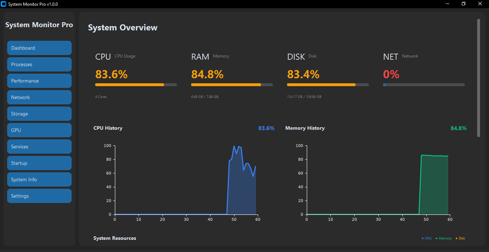
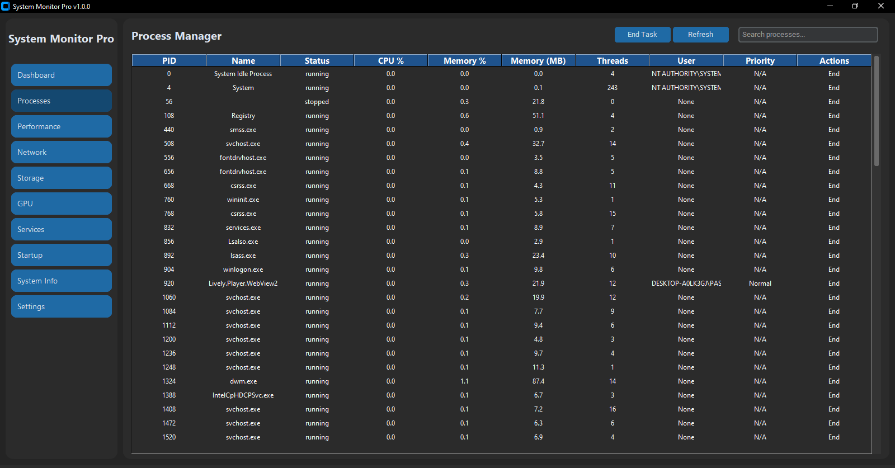
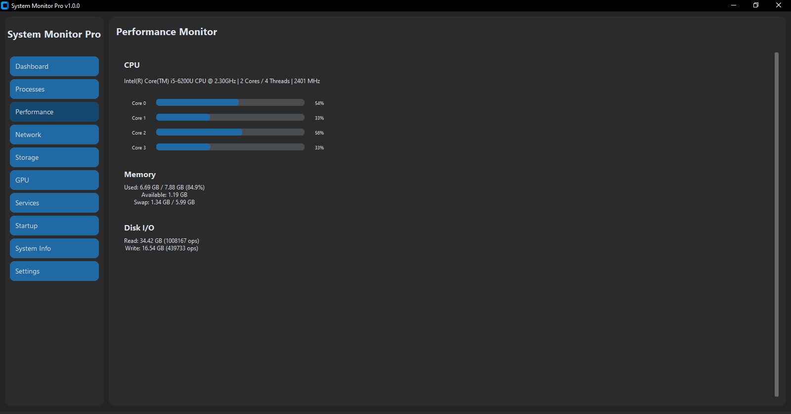
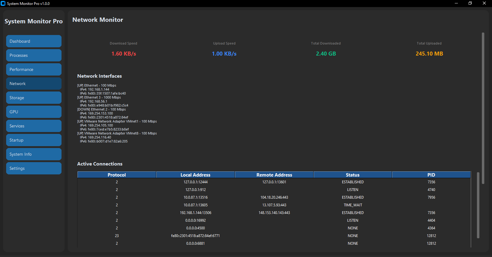
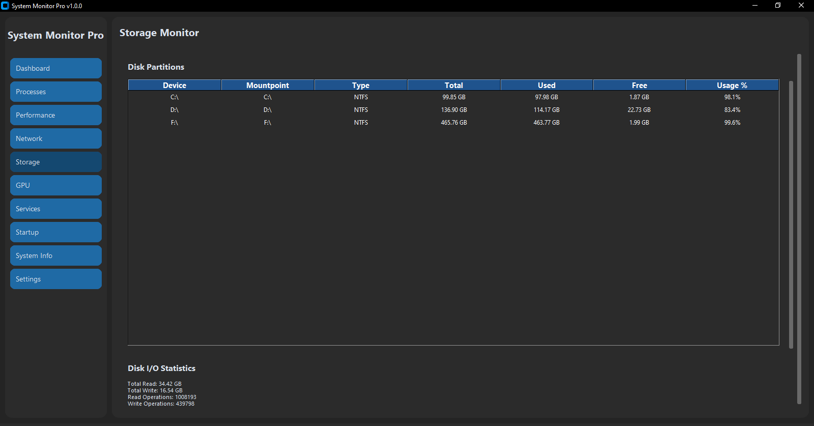
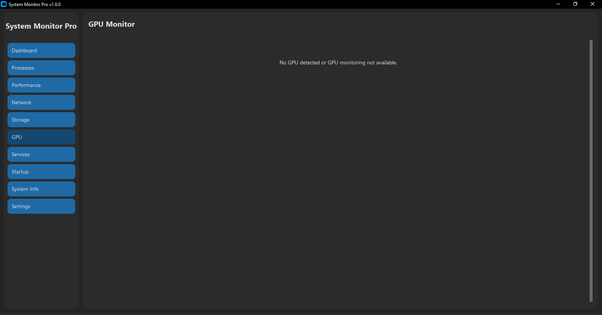
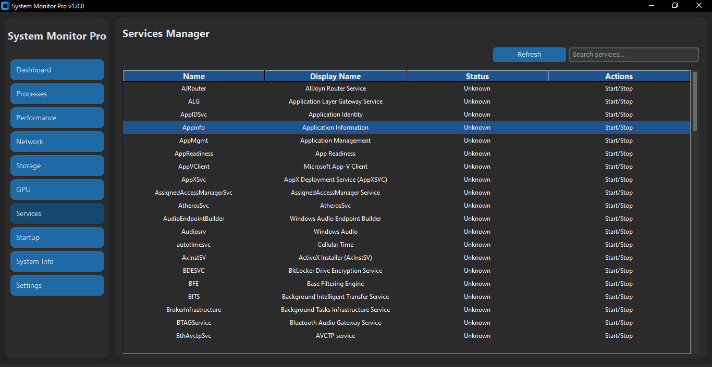
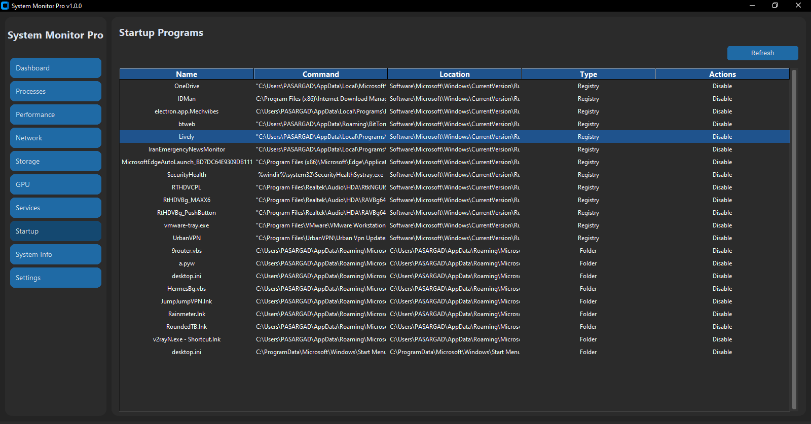
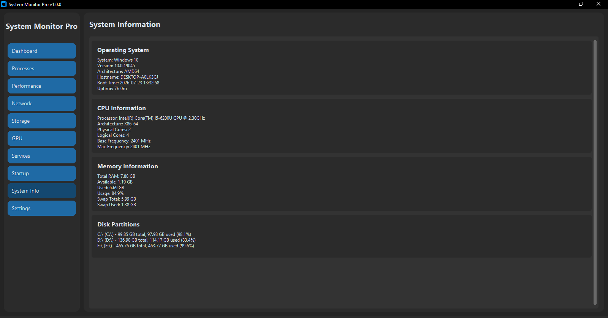

<div align="center">

# 🔥 System Monitor Pro

**A powerful, modern system monitoring tool built with Python and CustomTkinter.**

*Better than Task Manager. Dark. Fast. Beautiful.*

[](https://python.org)
[](https://github.com/TomSchimansky/CustomTkinter)
[](LICENSE)
[]()



</div>

---

## ✨ Features

<table>
<tr>
<td width="50%">

### 🖥️ System Overview
- **Real-time Dashboard** with live metric cards
- **Interactive Charts** (CPU, Memory, Disk history)
- **Multi-metric overlay** for resource comparison
- Color-coded status indicators (Green/Yellow/Red)

### ⚙️ Process Manager
- Full process control: **view, search, sort, kill**
- Change process **priorities** on the fly
- Real-time CPU & Memory usage per process
- Filter by name, PID, or username

### 📊 Performance Monitor
- **Per-core CPU** usage bars
- Detailed **memory breakdown** (used, available, swap)
- **Disk I/O** statistics (read/write counters)
- Live updates every second

</td>
<td width="50%">

### 🌐 Network Monitor
- Real-time **download/upload speed**
- **Network interfaces** with IP addresses
- **Active connections** table (protocol, local/remote, status)
- Total data transferred tracking

### 💾 Storage Monitor
- All **disk partitions** with usage bars
- **File system type** detection
- **Disk I/O** read/write statistics
- Space usage visualization

### 🎮 GPU Monitor
- **NVIDIA/AMD** GPU load & memory
- **Temperature** monitoring with color alerts
- GPU memory usage breakdown
- Multi-GPU support

</td>
</tr>
</table>

### 🔧 Advanced Tools

| Feature | Description |
|---------|-------------|
| **Services Manager** | Start, stop, restart Windows services |
| **Startup Manager** | Manage registry & folder startup items |
| **System Information** | Complete hardware & OS details |
| **Customizable Settings** | Dark/Light themes, alert thresholds |

---

## 📸 Screenshots

<div align="center">

| Dashboard | Process Manager | Performance |
|:---:|:---:|:---:|
|  |  |  |
| **Network** | **Storage** | **GPU** |
|  |  |  |
| **Services** | **Startup** | **System Info** |
|  |  |  |

*Settings panel: `screenshots/10_settings.png`*

</div>

---

## 🚀 Quick Start

### Prerequisites
- Python **3.8+**
- Windows 10/11, Linux, or macOS

### Installation

```bash
# Clone the repository
git clone https://github.com/Taha-Azadi/System_Monitor.git
cd System_Monitor

# Install dependencies
pip install -r requirements.txt

# Run the application
python main.py
```

### Optional: GPU Support (NVIDIA)
For GPU monitoring, ensure `nvidia-smi` is available in your PATH, or install:
```bash
pip install GPUtil
```

---

## 📦 Dependencies

| Package | Version | Purpose |
|---------|---------|---------|
| `customtkinter` | >=5.2.2 | Modern UI framework |
| `psutil` | >=5.9.8 | System & process utilities |
| `matplotlib` | >=3.8.0 | Real-time performance charts |
| `py-cpuinfo` | >=9.0.0 | Detailed CPU information |
| `GPUtil` | >=1.4.0 | GPU monitoring *(optional)* |
| `wmi` | >=1.5.1 | Windows WMI *(Windows only)* |

See [`requirements.txt`](requirements.txt) for the full list.

---

## 🎨 Themes

System Monitor Pro supports multiple built-in themes:

- **🌑 Dark** (default) — Sleek dark interface
- **☀️ Light** — Clean light mode
- **🟣 Cyberpunk** — Neon accent colors
- **🔵 Ocean** — Deep blue palette

Switch themes instantly from the **Settings** panel.

---

## 🛠️ Project Structure

```
SystemMonitor/
├── main.py                 # Entry point
├── requirements.txt        # Python dependencies
├── LICENSE                 # MIT License
├── README.md              # This file
├── screenshots/           # Application screenshots
│   ├── 01_dashboard.png
│   ├── 02_processes.png
│   ├── 03_performance.png
│   ├── 04_network.png
│   ├── 05_storage.png
│   ├── 06_gpu.png
│   ├── 07_services.png
│   ├── 08_startup.png
│   ├── 09_system_info.png
│   └── 10_settings.png
├── docs/
│   └── usage.md           # Detailed usage guide
└── src/
    ├── app.py             # Main application & navigation
    ├── dashboard.py       # Overview with charts & cards
    ├── process_manager.py # Process control & management
    ├── performance_charts.py # Matplotlib real-time charts
    ├── system_info.py     # Hardware & OS details
    ├── network_monitor.py # Network speed & connections
    ├── storage_monitor.py # Disk partitions & I/O
    ├── gpu_monitor.py     # GPU usage & temperature
    ├── services_manager.py # Windows services control
    ├── startup_manager.py # Startup programs management
    ├── settings.py        # Configuration persistence
    ├── utils.py           # Formatters & helpers
    ├── themes.py          # Custom color themes
    └── constants.py       # Application constants
```

---

## 📝 Usage

1. **Launch** the app: `python main.py`
2. **Navigate** using the sidebar to switch views
3. **Monitor** real-time system metrics on the Dashboard
4. **Manage** processes, services, and startup items
5. **Customize** themes and alert thresholds in Settings

For detailed usage instructions, see [`docs/usage.md`](docs/usage.md).

---

## 🤝 Contributing

Contributions are welcome! Feel free to open issues or submit pull requests.

1. Fork the repository
2. Create your feature branch (`git checkout -b feature/AmazingFeature`)
3. Commit your changes (`git commit -m 'Add some AmazingFeature'`)
4. Push to the branch (`git push origin feature/AmazingFeature`)
5. Open a Pull Request

---

## 📄 License

Distributed under the **MIT License**. See [`LICENSE`](LICENSE) for more information.

---

<div align="center">

**Made with ❤️ by [Taha-Azadi](https://github.com/Taha-Azadi)**

⭐ Star this repo if you find it useful!

</div>
